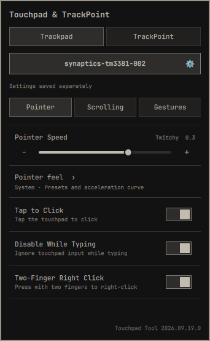
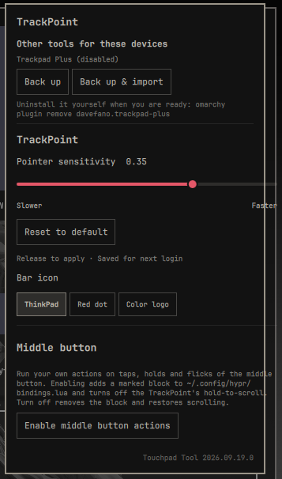

# Touchpad Tool for Omarchy

**One panel for the touchpad and the TrackPoint.**

Touchpad Tool merges two Omarchy bar widgets into one:

- [omarchy-trackpad-plus](https://github.com/davefano/omarchy-trackpad-plus) by
  David Fano (itself a fork of Andrew Kent's `omarchy-touchpad-widget`) for
  per-device trackpad controls and pointer-feel tuning
- [omarchy-trackpoint](https://github.com/ArtMoreno/omarchy-trackpoint) by
  ArtMoreno for TrackPoint sensitivity and a programmable middle button

The merged widget detects what the machine actually has, shows a tab per device
kind, and keeps each tool's own layout and look inside its tab. The two device
settings paths were collapsed into one writer, so touchpad and TrackPoint
settings validate, apply and roll back the same way.

Not an official Omarchy project and not endorsed by the Omarchy team.

<table>
  <tr><th>Trackpad</th><th>TrackPoint</th></tr>
  <tr>
    <td valign="top"></td>
    <td valign="top"></td>
  </tr>
</table>

## Tabs

The bar icon opens the panel. The top level is one tab per device kind found on
the machine:

| Tab | Contents |
|---|---|
| **Trackpad** | Device selector, then **Pointer** (profiles, acceleration-curve editor, tap to click, disable while typing, two-finger right click), **Scrolling** (scroll speed, natural scrolling) and **Gestures** (three-finger workspace swipes, optional overview gesture with a test button) |
| **TrackPoint** | Sensitivity slider (−1 to 1), **Middle button** actions (tap, double/triple tap, hold, hold + flick, modifier + tap) with per-app profiles, and the bar icon choice |

Only the tabs that match attached hardware appear: with only a touchpad the tab
row is hidden and the panel opens straight into it, and the same holds for a
TrackPoint-only machine. Device detection lives in `devices.py`, so the panel and
the writers cannot disagree about what is attached.

The bar icon can be the red *ThinkPad* wordmark, a red TrackPoint dot, or the
color ThinkPad logo:

```sh
omarchy bar set local.touchpad-tool logo wordmark   # or: dot, color
```

Right-clicking the bar icon toggles the touchpad on the Trackpad tab.

## Requirements

- Omarchy with the Quattro shell (plugin manifest `schemaVersion` 1)
- `python3` (preinstalled on Omarchy)
- A trackpad or a ThinkPad-style TrackPoint that Hyprland reports (`hyprctl devices`)

## Install

```sh
ln -s "$PWD" ~/.config/omarchy/plugins/local.touchpad-tool   # or copy the folder
omarchy plugin enable local.touchpad-tool
```

Or straight from git:

```sh
omarchy plugin add https://github.com/burgerwdev/omarchy-touchpad-tool.git --enable
```

## Other tools for these devices

If another trackpad or TrackPoint plugin is installed, or if the tools this one
replaces left blocks behind in your Hyprland config, the panel shows an
**Other tools for these devices** section. Each action backs up first and only
runs when you press it:

| Action | What it does |
|---|---|
| **Back up** | Copies every file this plugin owns or edits into `~/.local/state/omarchy/touchpad-tool/backups/<timestamp>/` (private, with a manifest) |
| **Back up & disable** | Backs up, then runs `omarchy plugin disable <id>` for the other plugin |
| **Back up & import** | Backs up, takes over the old TrackPoint sensitivity, and renames legacy gesture/middle-button blocks to this plugin |

Uninstalling is deliberately left to you; the panel prints the command to run:

```sh
omarchy plugin remove <plugin-id>
```

This tool never removes another plugin on its own. Removing one is your step, so
a misjudged click can never delete something you installed.

## What it changes on your system

| When | File | Change |
|---|---|---|
| You change any touchpad or TrackPoint setting | `~/.local/state/omarchy/toggles/hypr/zz-local-touchpads.lua` | Rewrites the generated `hl.device(...)` rules |
| The same | `~/.local/state/omarchy/local-touchpads/settings.json` | Saved per-device settings (shared with Trackpad Plus, so existing tuning carries over) |
| You configure the middle button | `~/.local/state/omarchy/trackpoint/middle.json` | Middle-button profiles and actions |
| You press **Enable middle button actions** | `~/.config/hypr/bindings.lua` | Adds a marked block of binds between `-- BEGIN local.touchpad-tool middle button` and `-- END`, and hands the middle button back from hold-to-scroll |
| You apply **Gestures** | `~/.config/hypr/input.lua` | Gesture rules between `-- BEGIN local.touchpad-tool gestures` and `-- END`, with the original settings kept for restore |
| Any conflict action | `~/.local/state/omarchy/touchpad-tool/backups/` | Timestamped copies of the files above |

Every write is checked with `hyprctl configerrors` and put back if Hyprland
reports a problem. Pointer and scrolling settings are saved separately per
device group; gestures apply across trackpads.

## Remove

1. Open the panel and press **Turn off** next to *Middle button* if you enabled it.
   That restores scrolling and removes the bind block.
2. Restore your gestures from the **Gestures** tab if you applied them.
3. Disable and remove the plugin:

   ```sh
   omarchy plugin disable local.touchpad-tool
   omarchy plugin remove local.touchpad-tool
   ```

4. Optionally delete the saved settings, backups and generated rules:

   ```sh
   rm -rf ~/.local/state/omarchy/local-touchpads
   rm -rf ~/.local/state/omarchy/trackpoint
   rm -rf ~/.local/state/omarchy/touchpad-tool
   rm -f ~/.local/state/omarchy/toggles/hypr/zz-local-touchpads.lua
   ```

If you removed the plugin without step 1, delete the block between
`-- BEGIN local.touchpad-tool middle button` and its `-- END` line in
`~/.config/hypr/bindings.lua`, then run `hyprctl reload`.

## Development

See [DEVELOPMENT.md](DEVELOPMENT.md) for the architecture and the full test
suite. In short:

```sh
python3 test_trackpads.py && python3 test_trackpoints.py && python3 test_middle.py && \
python3 test_adopt.py && python3 test_devices.py && python3 test_install.py && \
python3 test_gestures.py && python3 test_overview_control.py && python3 test_overview_ipc.py && \
node test-devicetabs.js && node test-selection.js && node test-overview-model.js && \
python3 lint-qml.py
```

The upstream projects this one merges are kept under `docs/upstream/` for
reference, and their screenshots under `assets/screenshots/upstream/`.

## Notes

- Actions run your commands with your user's shell. Custom commands are yours to review.
- No network access, no elevated privileges, no background services.

## License

[MIT](LICENSE), with the copyright notices of both upstream projects:
Andrew Kent and David Fano (Trackpad Plus) and ArtMoreno (TrackPoint).
